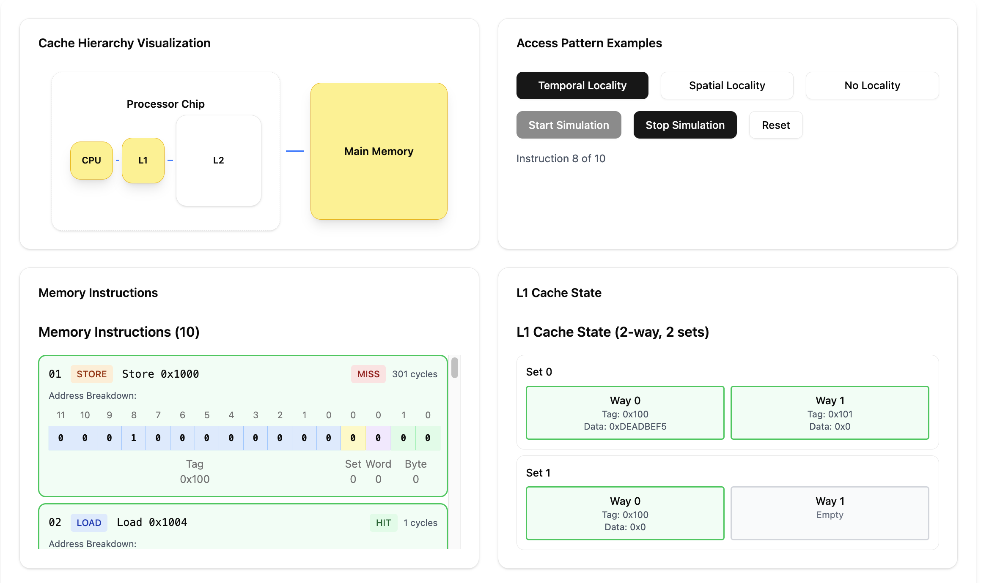
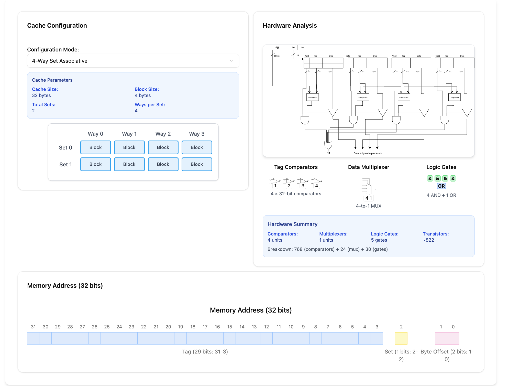
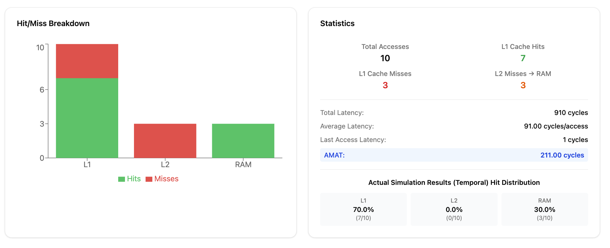

# Cache Memory Documentation

## Program Structure Overview

This visualization system is built as a React/TypeScript application with modular components for teaching cache memory concepts through interactive cache simulations and visual demonstrations.

### Project Architecture

The main cache visualization code is located in `src/pages/csc368/cache/` and consists of two primary visualizations:

#### Cache Hierarchy Visualization (`Hierarchy.tsx`)

- **Purpose**: Demonstrates cache hierarchy, memory access patterns, and locality principles
- **Component**: `CacheHierarchyVisualization`
- **Features**:
  - L1 cache simulation with 2-way set associative mapping
  - Memory instruction execution with real cache behavior
  - Address breakdown visualization (tag, set, word, byte offsets)
  - Temporal, spatial, and no-locality access pattern examples
  - Interactive cache block inspection with detailed information
  - AMAT (Average Memory Access Time) calculation
  - Hit/miss statistics and performance metrics



#### Cache Associativity Visualization (`associativity.tsx` & `Associativity.tsx`)

- **Purpose**: Explores different cache associativity types and their trade-offs in particular towards hardware
- **Component**: `AssociativityVisualization`
- **Features**:
  - Direct-mapped, set-associative, and fully-associative cache comparisons
  - Visual representation of hardware configuration
  - Visualize the impact of changing the associativity
  - View in detail the blocks involved with the cache line
  - Conflict miss demonstration with different associativity levels
  - Address mapping examples and hardware view for each associativity type

### Core Components Structure

```
components/
├── Config.ts                     # Configuration constants and feature flags
├── Hierarchy.tsx                 # Main cache hierarchy simulation
├── Associativity.tsx            # Cache associativity comparison
├── BinaryBlock.tsx              # Binary address visualization blocks
└── index.ts                     # Component exports
```

### Key Data Structures

**Cache Configuration** (`Hierarchy.tsx`):

- L1 cache: 32 bytes total, 8-byte blocks, 2-way set associative, 2 sets
- Block size: 8 bytes (2 words per block for spatial locality demonstration)
- Replacement policy: LRU (Least Recently Used)

**Memory Instruction Interface**:

- Tracks load/store operations with specific memory addresses
- Maintains cache state changes and access history
- Records hit/miss information and latency calculations
- Supports different access patterns (temporal, spatial, no locality)

**Address Parsing**:
For example, one parse for a 16 bit cache line could be as follows

- Tag bits: 12 bits (cache line identification)
- Set index: 1 bit (2 sets total)
- Word offset: 1 bit (which word in the 8-byte block)
- Byte offset: 2 bits (which byte within the word)

### Visualization Features

#### Interactive Controls

- **Access Pattern Selection**: Choose between temporal locality, spatial locality, or no locality
- **Simulation Control**: Start/stop/reset memory instruction execution
- **Cache Inspection**: Click cache blocks to view detailed information
- **Binary Address Breakdown**: Visual representation of address bit fields



#### Features

There are multiple feature flags in the `Config.ts` file which allow for configuration of the following features:

- **Memory Access Patterns**: Three different instruction sequences demonstrating:

  - **Temporal Locality**: Repeated access to same memory addresses
  - **Spatial Locality**: Sequential access to nearby memory addresses
  - **No Locality**: Random access causing frequent cache conflicts

- **Interactive Cache State**: Real-time visualization of cache contents including:

  - Valid/invalid block status
  - Tag values and stored data
  - Last access timestamps
  - Memory address range mapping

- **Address Visualization**: Binary breakdown showing how memory addresses map to cache:

  - Color-coded bit fields (tag, set, word, byte)
  - Hover effects for enhanced interactivity
  - Aligned display for clear visual hierarchy

- **Performance Metrics**: Comprehensive statistics including:

  - Total memory accesses and hit/miss counts
  - L1 cache hit rate and miss penalties
  - AMAT calculation based on actual simulation
  - Latency breakdown per access level
  - Chart visualization with stacked bar graph indicating results on each stage

- **Latency Configuration**: Configurable memory hierarchy latencies (disabled by default)

  - L1 cache: 1 cycle
  - L2 cache: 10 cycles
  - RAM: 300 cycles
  - Set `latencyConfigUIEnabled = true` in Config.ts to enable

- **Access Counts Visualization**: Hit/miss breakdown charts (enabled by default)

  - Stacked bar charts showing hit/miss distribution
  - Real-time updates during simulation
  - Set `accessCountsUIEnabled = false` in Config.ts to disable

- **Cache Block Details**: Detailed inspection dialogs showing:
  - Block status (valid/invalid)
  - Tag information in hex, decimal, and binary
  - Stored data in multiple formats
  - Access timing and memory address ranges

### Technical Implementation

The visualizations use **React hooks** for state management, **TypeScript** for type safety, and custom UI components for consistent styling. The cache simulation implements actual cache behavior including:

- **LRU Replacement Policy**: Tracks access timestamps for block replacement
- **Address Mapping**: Proper bit-level address parsing for cache indexing
- **Memory Instruction Simulation**: Step-by-step execution with realistic timing
- **Interactive Tooltips**: Context-sensitive information on hover

### Cache Configuration Details

**L1 Cache Specifications**:

- Total size: 32 bytes
- Block size: 8 bytes (enables spatial locality demonstration) or 4 bytes depending on selected
- Associativity: Configurable from direct mapped to fully associative
- Number of sets: Depends on configuration

**Address Format** (32-bit example addresses):

```
| Tag (27 bits) | Set (1 bit) | Word (1 bit) | Byte (2 bits) |
| 31        4   |      3      |      2       |    1     0    |
```



### Future Development Items

- Prefetching strategies and their impact on performance
- Variable cache sizes and associativity comparison
- Cache miss classification (compulsory, capacity, conflict)
- Real workload traces and expanded analysis
- Transistors calculation analyze further whether it is accurate
- Quiz modes and additional interaction to test users

### Resources

The original plan for tackling this visualization is viewable [here](/docs/comp_arch/caches/csc494-cache-plan.pdf).
