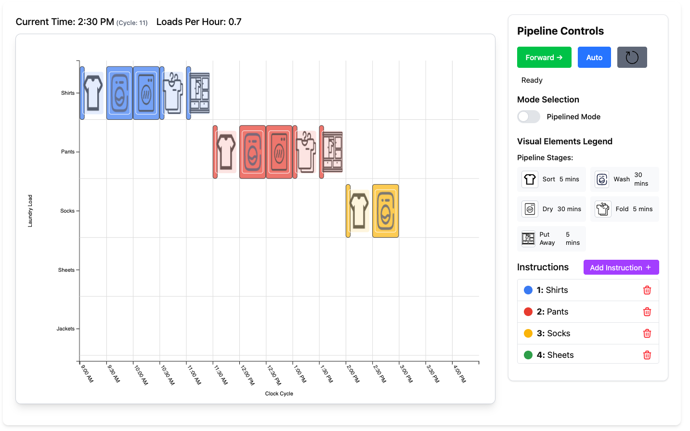
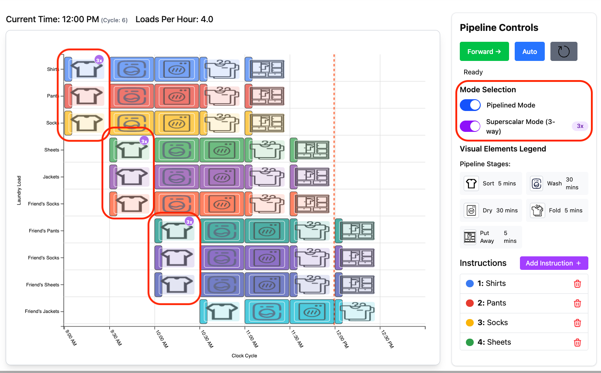
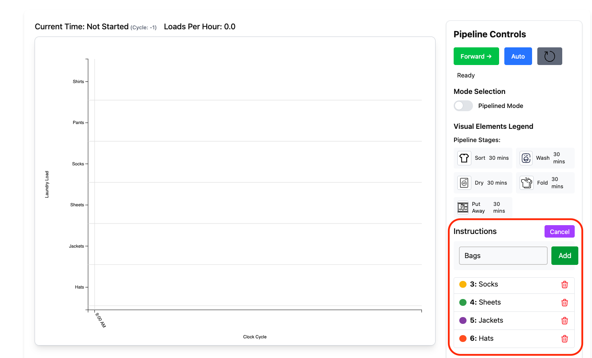
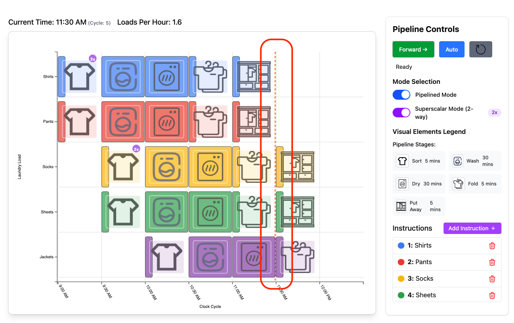
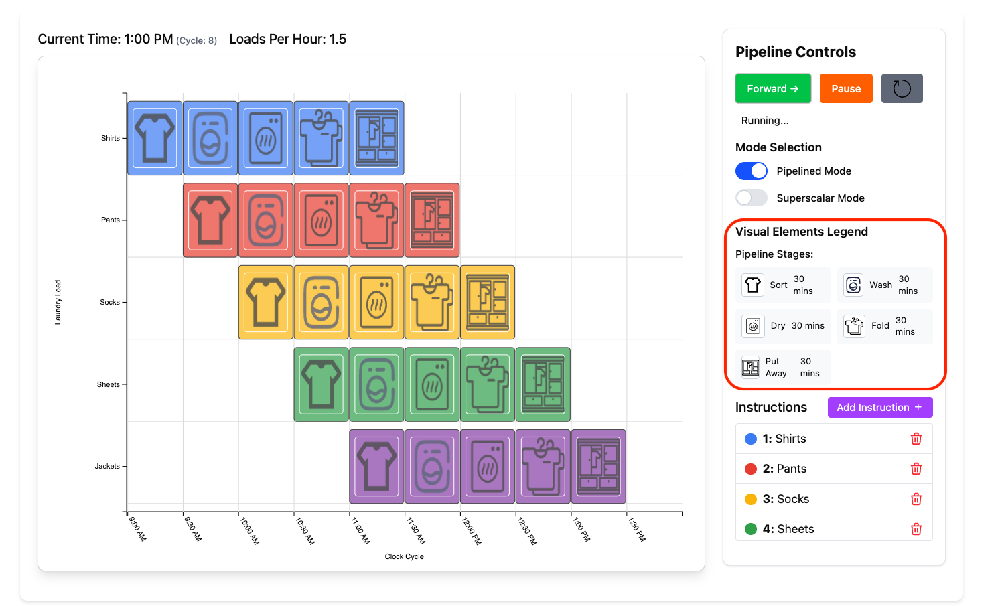
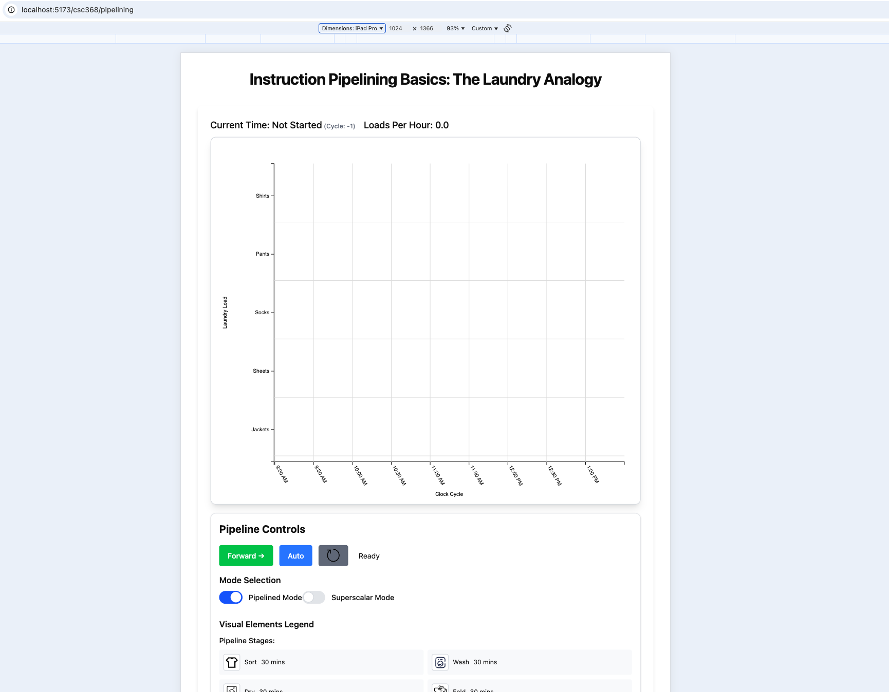
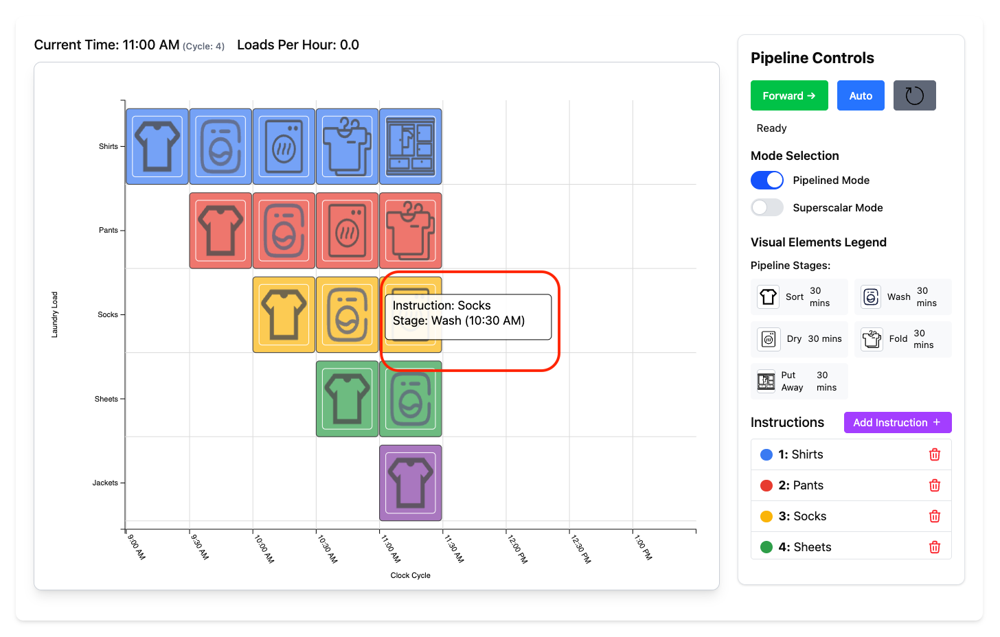
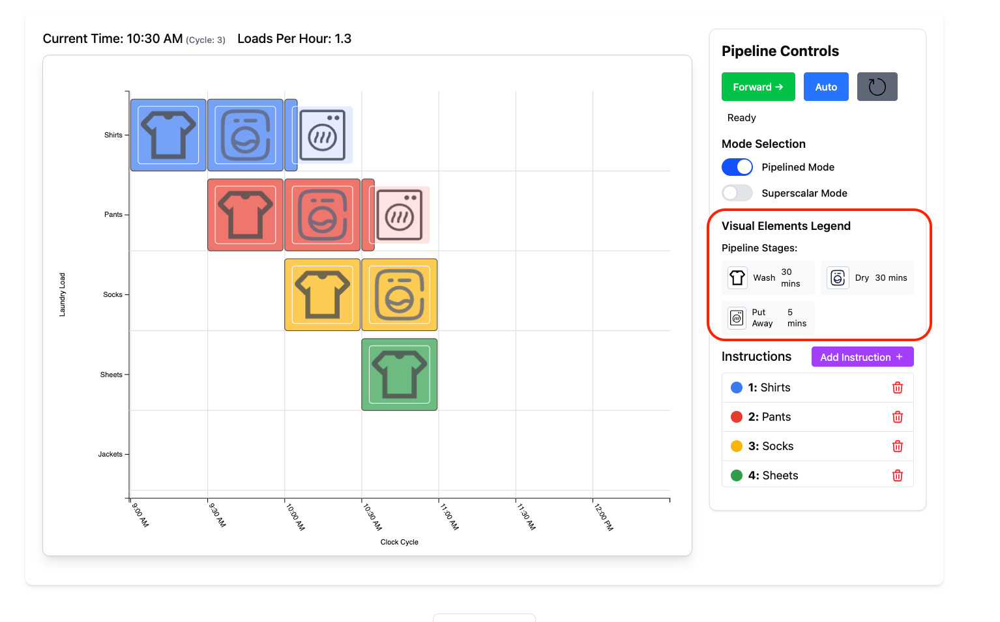

# Processor Pipelines Documentation

## Program Structure Overview

This visualization system is built as a React/TypeScript application with modular components for teaching computer architecture concepts through interactive pipeline visualizations.

### Project Architecture

The main pipeline visualization code is located in `src/pages/csc368/pipelining/` and consists of one primary visualization:

#### Laundry Analogy Pipeline Visualization (`pipelining.tsx`)
- **Purpose**: Introduces pipelining concepts using a laundry analogy
- **Component**: `PipelineVisualization`
- **Features**: 
  - 5-stage pipeline simulation (Sort, Wash, Dry, Fold, Store)
  - Pipelined vs non-pipelined execution comparison
  - Superscalar execution mode (multiple instructions per cycle)
  - Real-time performance metrics (CPI, IPC, loads per hour)

### Core Components Structure

```
components/
├── config.ts                     # Configuration constants and defaults
├── PipelineVisualization.tsx      # Main laundry analogy visualization
├── PipelineStage.tsx             # Individual pipeline stage rendering
├── PipelineTooltip.tsx           # Interactive hover information
├── Axis.tsx                      # Chart axes (time/instruction labels)
├── Grid.tsx                      # Background grid lines
├── StagePatterns.tsx             # SVG pattern definitions
├── types.ts                      # TypeScript interface definitions
└── index.ts                      # Component exports
```

### Key Data Structures

**Instruction Interface** (`types.ts`):
- Tracks instruction state through pipeline stages
- Manages register dependencies (source/destination registers)
- Monitors stall conditions and completion status
- Maintains stage history for visualization

**Pipeline Stage Configuration**:
- Configurable stage names, colors, and durations
- Support for multi-cycle stages (e.g., memory operations)
- Dynamic stage timing adjustment during simulation

### Visualization Features

#### Interactive Controls
- **Playback Control**: Play/pause/step/reset simulation
- **Speed Control**: Adjustable simulation speed (100ms - 2s per cycle)
- **Mode Selection**: Toggle between pipelined/non-pipelined execution
- **Instruction Management**: Add/remove custom instructions dynamically

#### Performance Metrics
- **CPI (Cycles Per Instruction)**: Real-time calculation with theoretical minimums
- **IPC (Instructions Per Cycle)**: Throughput measurement
- **Speedup Analysis**: Comparison against sequential execution
- **Time Conversion**: Multiple time units (cycles, seconds, minutes, hours)

#### Features
There are multiple feature flags in the `config.tx` and on the UI which will allow for configuration of the following features. 

- **Single Cycle vs Pipelined**: Change between single cycle and pipelined visualization.


- **Superscalar Execution**: Configurable number of instructions per cycle simulated


- **Dynamic Instruction Addition**: Interactive interface for adding custom instructions


- **Cycle Highlighting with Tick Marker**: Visual emphasis on specific cycles. This indicates the last executed stage.


- **Stage Lengths**: Visualize different stage lengths. Drying and washing often will take longer than folding/putting away laundry. However, in a pipelined processor (especially RISC processors where each stage is one cycle) each "clock cycle" is limited by the latency of the worst stage. 


- **Responsive Design**: Adaptive layout for different screen sizes (tablet/desktop). Mobile support is difficult due to rendering a horizontal chart. 


- **Tooltips**: Tooltips indicating which stage and instruction on hover. See `tooltips.ts` for tooltip specific configs.


- **Configurable Number of Stages**: Configurable number of stages for processors with anywhere from 1-5 stages. E.g. 3-stage Cortex M4 processors.


### Technical Implementation

The visualizations use **D3.js** for SVG rendering and scale management, **React hooks** for state management, and **TypeScript** for type safety. The modular design allows for easy extension and customization of pipeline configurations.

### Future Development Items

- superscalar pipelines
- changing configurations per stage
- branch prediction visualization
- cache memory integration
- out-of-order execution simulation
- enable visualizing RISC instructions


### Resources
Mockups: The file [pipelining-mockups](pipelining-mockups.pdf) contains initial designs for Processor Pipelining.
